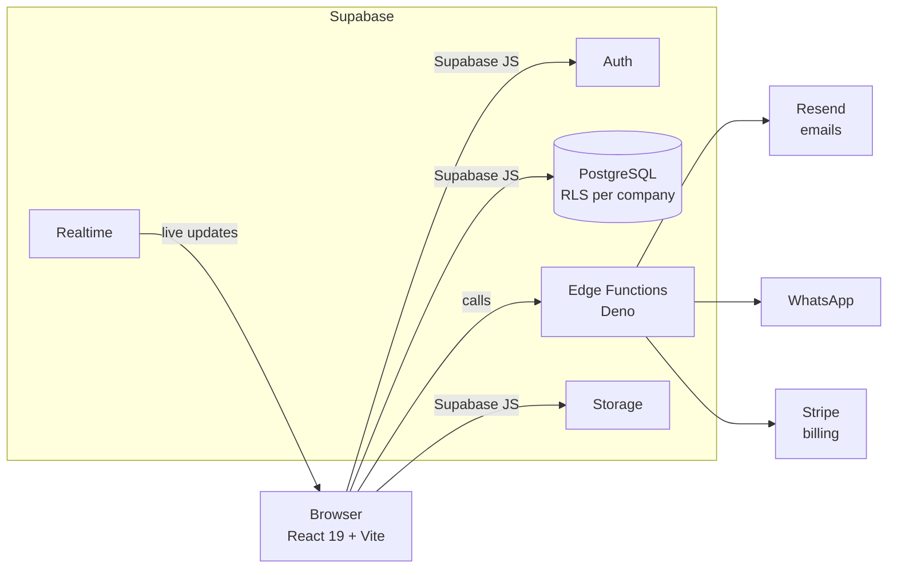
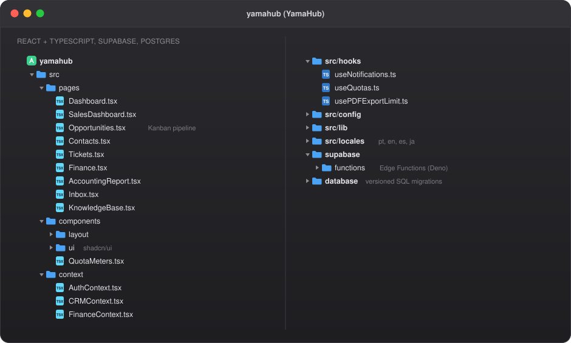

> 🔒 **The source code is private.** This repo explains what the platform does, how it is built and the main decisions I made. I'm happy to walk through the real code in an interview.

## What it is

YamaHub is a multi tenant business management platform (SaaS). Many companies use the same system, and each one only sees its own data. It goes beyond a classic CRM: sales, projects, support, finance and reports live in one panel.

🚧 **Status:** the platform is in final testing and will launch soon.

## Modules

| Module | What it does |
|---|---|
| 📊 **Dashboard** | KPIs, sales funnel and recent activity |
| 🧑‍💼 **Seller dashboard** | Each salesperson sees their goal, results and estimated commission |
| 👥 **Contacts** | Full CRUD with search and pagination |
| 🎯 **Opportunities** | Kanban pipeline by stage |
| ✅ **Tasks** | Schedules and reminders |
| 📁 **Projects** | Owner, warranty and status |
| 🎧 **Support tickets** | SLA, priority, internal and public chat, history |
| 💰 **Finance** | Income, expenses, accounts and cash flow |
| 🧾 **Accounting report** | One report the company can send to its accountant |
| 📤 **Reports** | CSV and PDF export with limits by plan |
| 🔎 **Global search** | `⌘K` to find contacts, deals and tickets |
| 🔔 **Notifications** | Real time notification center |

## Highlights

**Multi tenant security with Row Level Security.** Every table is protected in PostgreSQL itself. Even if a request skips the frontend, a company cannot read another company's data.

**Roles and permissions.** A super admin manages all companies. Inside each company there are roles like admin and sales, and each one sees a different part of the system. Team members can leave through a safe offboarding flow.

**Plans with real limits.** Each plan limits users, contacts, storage and exports. Usage meters show how much is left, and the UI shows upgrade messages instead of just blocking the user.

**Billing with Stripe.** Subscriptions and payments run on Stripe. A billing lifecycle function keeps each company’s plan and access in sync, with a paywall for users and a subscriptions panel for the admin.

**Real time.** Notifications and badges update live with Supabase Realtime.

**Four languages.** Portuguese, English, Spanish and Japanese with i18next. There are no hard coded strings in the code.

**Integrations.** Emails go out through Supabase Edge Functions (Deno) with Resend. WhatsApp messages come into a shared inbox, and an AI assistant can answer them using the company’s own knowledge base.

## Architecture

  

The real folder structure of the project. Only file names are shown, the code stays private.

## Tech stack

| Layer | Tools |
|---|---|
| Frontend | React 19, Vite, TypeScript |
| UI | Tailwind CSS, shadcn/ui (Radix UI), Motion animations |
| Charts and export | Recharts, jsPDF |
| Database | PostgreSQL on Supabase with Row Level Security |
| Auth and realtime | Supabase Auth, Supabase Realtime |
| Server logic | Supabase Edge Functions (Deno) |
| Payments | Stripe |
| Email | Resend |
| i18n | i18next (pt, en, es, ja) |

## Screenshots

_Coming soon._

---

Built by [Charles Yamamoto](https://github.com/Lophiester) · [LinkedIn](https://www.linkedin.com/in/charles-yamamoto-26699b203/) · [yamaflare.com](https://yamaflare.com)

